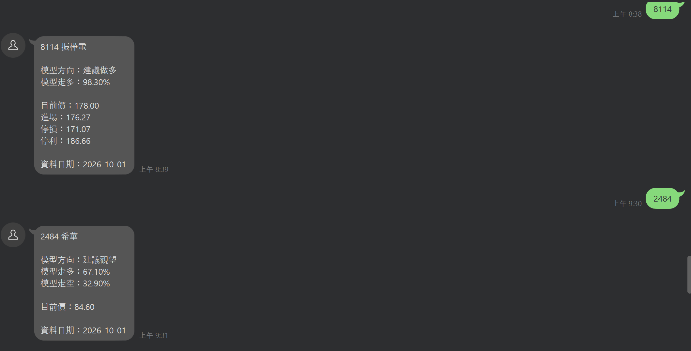
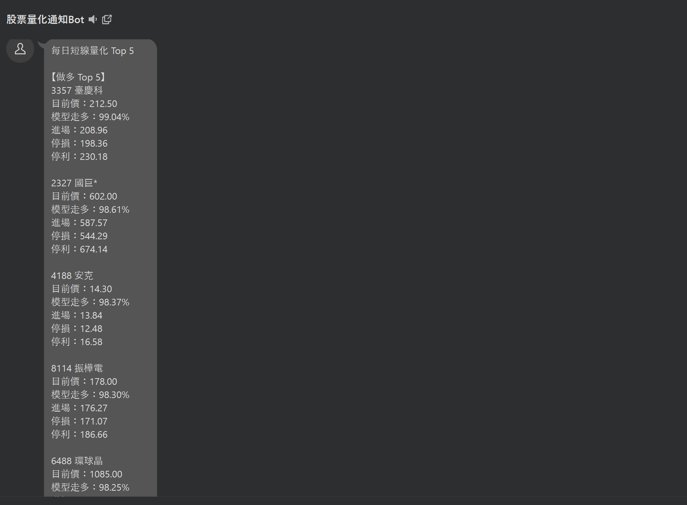

# Stock Quantitative Analysis & LINE Bot

A quantitative stock analysis system for the Taiwan stock market that integrates
technical indicators, institutional trading data, deep learning, FastAPI,
LINE Bot, and cloud deployment.

本專案建立一套台股短線量化分析流程，將技術面與法人籌碼資料轉換為模型特徵，
並利用 Transformer 預測未來 5 個交易日的股價方向。

系統同時支援單一股票分析與全市場掃描，並可透過 LINE Bot 回傳模型預測結果。

---

## Demo

### Single Stock Analysis

輸入股票代號後，系統即時回傳模型預測方向、機率與風險管理參考資訊。



### Daily Quantitative Ranking

系統可掃描台股市場，依模型預測機率產生每日短線 Top 5 候選股票。



## Try the LINE Bot

Linebot QRcode.


## Project Overview

The system consists of four main stages:

1. Data Collection
2. Feature Engineering
3. Machine Learning / Deep Learning Prediction
4. LINE Bot & Cloud Deployment

主要流程：

```text
Stock Price Data
        +
Institutional Trading Data
        ↓
Feature Engineering
        ↓
20-day Time Series
        ↓
Transformer Model
        ↓
Probability of Up / Down
        ↓
Trading Signal
        ↓
FastAPI
        ↓
LINE Bot
